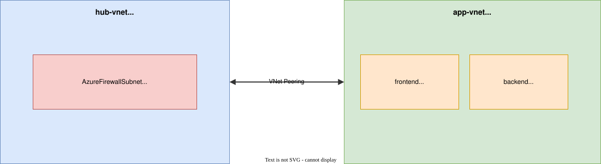

# Lab: Exercise 01: Create and configure virtual networks

**Certification:** AZ-104  
**Module:** [Exercise 01: Create and configure virtual networks](https://microsoftlearning.github.io/Configure-secure-access-to-workloads-with-Azure-virtual-networking-services/Instructions/Labs/LAB_01_virtual_networks.html)  
**Date completed:** 2026-07-24  

## Scenario

> _A company is migrating its web-based application to Azure and needs to set up the network structure. It wants to create a hub and spoke network architecture so the basis is two virtual networks connected with network peering._

## Architecture



_Editable source: diagram.drawio_

## What I Did

This was a simple enough exercise, and the instructions were easy to follow. I created the two networks and connected them with network peering. Then I exported the configuration into bicep code and cleaned it up to get the IaC version.

## IaC Version


```bash
az deployment group create --resource-group RG1 --template-file main.bicep
```

See [main.bicep](./main.bicep) for the full template.

## Gotchas & Learnings

- **Learning:** There are two network peering resources in the bicep file because the peering can be asymmetric.  
    **Takeaway:** It makes sense to define one peering in each directtion. Especially in this case of a hub and spoke architecture.

## Resources

- [GitHub lab instructions link](https://microsoftlearning.github.io/Configure-secure-access-to-workloads-with-Azure-virtual-networking-services/Instructions/Labs/LAB_01_virtual_networks.html)


