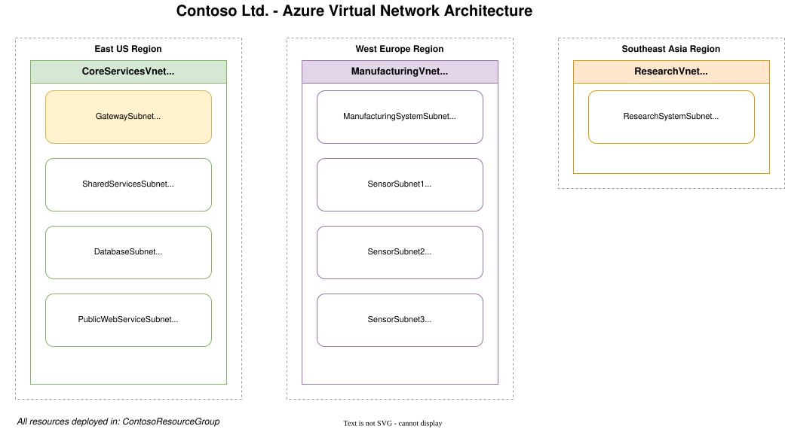

# Lab: M01 - Unit 4 Design and implement a Virtual Network in Azure

**Certification:** AZ-104  
**Module:** [M01 - Unit 4 Design and implement a Virtual Network in Azure](https://microsoftlearning.github.io/AZ-700-Designing-and-Implementing-Microsoft-Azure-Networking-Solutions/Instructions/Exercises/M01-Unit%204%20Design%20and%20implement%20a%20Virtual%20Network%20in%20Azure.html)  
**Date completed:** 2026-07-24  

## Scenario

> _The business wants to set up three different reasons. One for core operation services for the business, one for manufacturing facitity systems, and one for research and development. The first two virtual neworks are expected to contain a lot of devices or grow in the future, while the last one has a small stable number of VMs and is not expected to grow._

## Architecture




_Editable source: diagram.drawio_

## What I Did

The instructions were clear so it was relatively easy to create all VNets and Subnets. Then I used the export feature to get the bicep IAC code, which needed to be cleaned since there were some duplications.
In this scenario we utilize the 10.0.0.0/8 private IP range and divide it up into distinct subnets.

## IaC Version

See [main.bicep](./main.bicep) for the full template.

and this can be deployed into an existing resource group with
```zsh
az deployment group create \
  --resource-group ContosoResourceGroup \
  --template-file main.bicep
```


## Gotchas & Learnings
    
- **Problem:** How to define subnets that are unique but allow for extension later?   
    **Fix:** Increasing the ip range by 10: The first is 10.20.0.0/16 and the next one is 10.30.0.0/16, allowing for further possible subnets like 10.21.0.0/16 and also making the ranges more aesthetically pleasing for humans by using multiples of 10 as the base.
    **Takeaway:** Planning subnets should be done carefully, since there is a requirement that they do not overlap when one wants to peer them together. The best practice is to create unique subnets company wide, which requires some kind of coordination.
    


## Resources

- [Microsoft Learn module link](https://learn.microsoft.com/en-us/training/modules/introduction-to-azure-virtual-networks/)
- [GitHub lab instructions link](https://microsoftlearning.github.io/AZ-700-Designing-and-Implementing-Microsoft-Azure-Networking-Solutions/Instructions/Exercises/M01-Unit%204%20Design%20and%20implement%20a%20Virtual%20Network%20in%20Azure.html)


