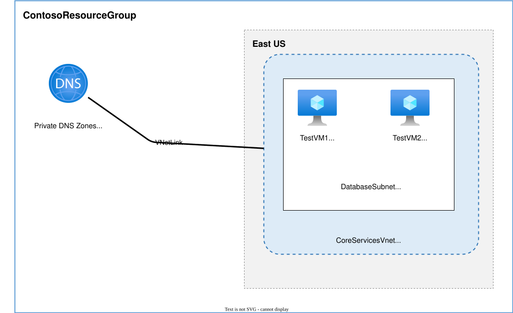

# Lab: M01 - Unit 6 Configure DNS settings in Azure

**Certification:** AZ-104  
**Module:** [M01 - Unit 6 Configure DNS settings in Azure](https://microsoftlearning.github.io/AZ-700-Designing-and-Implementing-Microsoft-Azure-Networking-Solutions/Instructions/Exercises/M01-Unit%206%20Configure%20DNS%20settings%20in%20Azure.html)  
**Date completed:** 2026-07-24  

## Scenario

> _The company wants to use a subnet without manually managing elements like VMs and have to hard-code internal IP addresses. So one wants to set up a private DNS zone and enable auto registration so that each part of the subnet gets a pirvate "web address" like `testvm1.contoso.com`_

## Architecture



_Editable source: diagram.drawio_

## What I Did

The Vnet and Subnets were already set up from another lab. So I created the private DNS Zone, linked it to the DatabaseSubnet and enabled auto registration.

To test the success, I created two VMs and resolved the address to the one from the other.

## Gotchas & Learnings
    
- **Problem:** The lab provides a IaC script to set up the VMs but it set up windows machines, but I could not access them. 
    **Fix:** I did not want to install the remote viewer program on my mac, so I did what I knew and created a Ubuntu VM that I could ssh into and so test the network resolution. I did try to use Bastion but it got stuck in the setup process, I guess for account privilege reasons.    
    **Takeaway:** Try to find a solution but don't waste too much time and focus on what you already know :)
    
- **Problem:** The lab offered instructions using PowerShell commands, but I use and know Bash, 
    **Fix:** So I translated the commands to the CLI variant, using an AI chat (of course)    
    **Takeaway:** At some point, I could learn the PowerShell syntax, but going from what I know (Bash CLI), I can do faster progress.

## IaC Version

After completing this lab via the portal, I recreated the infrastructure using Bicep:

```bash
az deployment group create --resource-group ContosoResourceGroup --template-file main.bicep
```

See [main.bicep](./main.bicep) for the full template.

## Resources

- [Microsoft Learn module link](https://learn.microsoft.com/en-us/training/modules/introduction-to-azure-virtual-networks/)
- [GitHub lab instructions link](https://microsoftlearning.github.io/AZ-700-Designing-and-Implementing-Microsoft-Azure-Networking-Solutions/Instructions/Exercises/M01-Unit%206%20Configure%20DNS%20settings%20in%20Azure.html)


