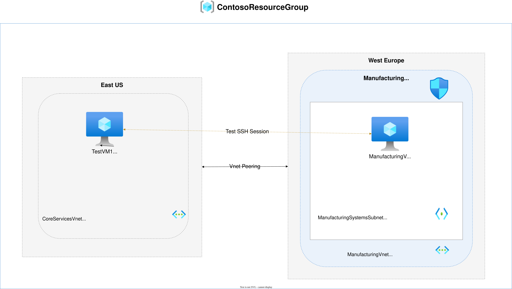
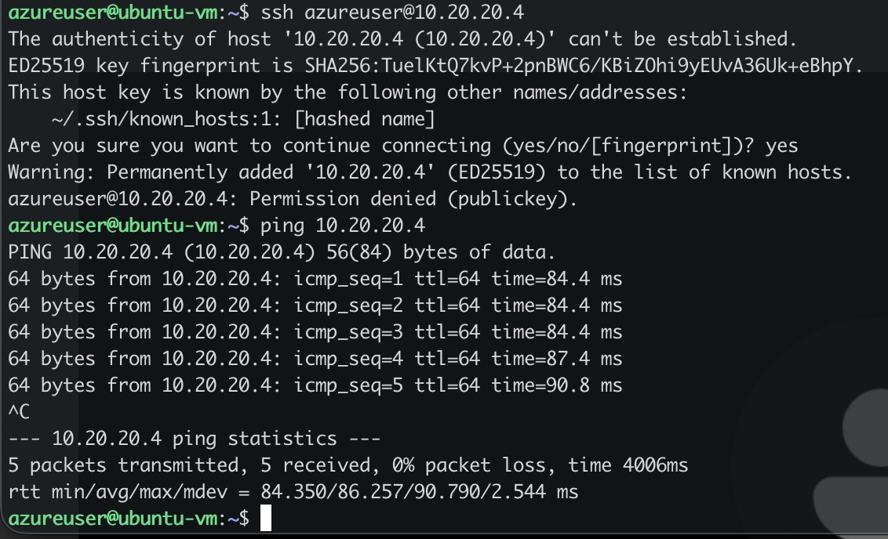
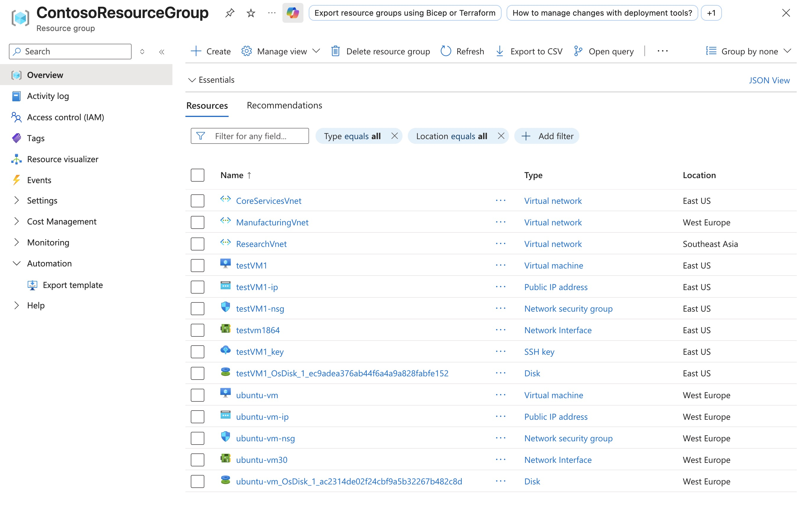

# Lab: M01 - Unit 8 Connect two Azure Virtual Networks using global virtual network peering

**Certification:** AZ-104  
**Module:** [M01 - Unit 8 Connect two Azure Virtual Networks using global virtual network peering](https://microsoftlearning.github.io/AZ-700-Designing-and-Implementing-Microsoft-Azure-Networking-Solutions/Instructions/Exercises/M01-Unit%208%20Connect%20two%20Azure%20Virtual%20Networks%20using%20global%20virtual%20network%20peering.html)  
**Date completed:** 2026-07-29  

## Scenario

> _The company has created several virtual networks, and now we want to connect them via network peering so that the resources can interact"_

## Architecture



_Editable source: diagram.drawio_

## What I Did

I created virtual machines on the two networks to test the connectivity. At first they could not reach each other, as expected because their virtual networks were not peered yet. After the peering was set up, they could communicate with each other:




## Screenshots

| Step                      | Screenshot                             |
| ------------------------- | -------------------------------------- |
| Resource group created    |    |

## Gotchas & Learnings

    
- **Problem:** The lab provided a template to create the VMs but the template did not work  
    **Fix:** I created the VMs manually.  
    **Takeaway:** I wanted to work with linux VMs anyway...

- **Problem:** The bicep code that the azure portal produces is messy and redundant. It's because Azure creates first a json and then converts it to bicep.  
    **Fix:** This is a known issue and I learnted what elements can be removed and did this by hand.   
    **Takeaway:** One suggestion is to use the Azure CLI to export the bicep code of a resource, because it is a different pipeline.

## IaC Version

I updated the [main.bicep](./main.bicep) with the new peering so that it now contains the network and peering definitions.

```bash
az deployment group create --resource-group ContosoResourceGroup --template-file main.bicep
```

## Resources

- [Microsoft Learn module link](https://learn.microsoft.com/en-us/training/modules/introduction-to-azure-virtual-networks/8-exercise-connect-two-azure-virtual-networks-global)
- [GitHub lab instructions link](https://microsoftlearning.github.io/AZ-700-Designing-and-Implementing-Microsoft-Azure-Networking-Solutions/Instructions/Exercises/M01-Unit%208%20Connect%20two%20Azure%20Virtual%20Networks%20using%20global%20virtual%20network%20peering.html)


