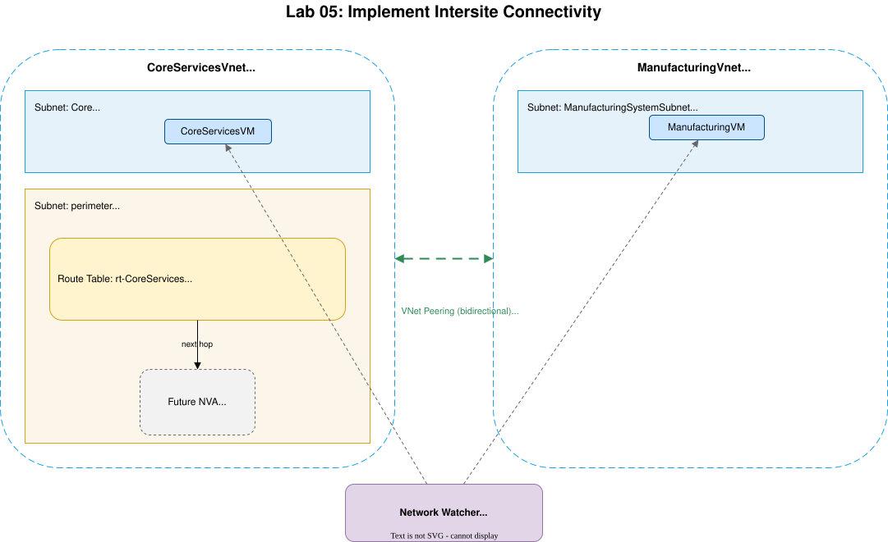
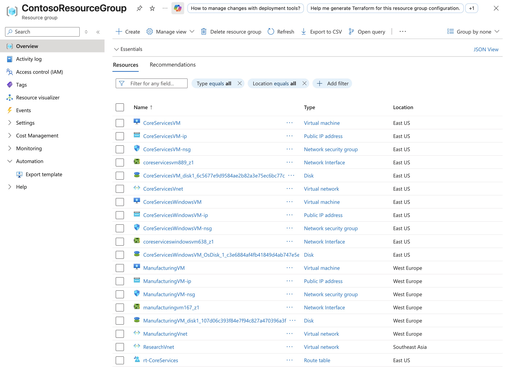

# Lab: Lab 05 - Implement Intersite Connectivity

**Certification:** AZ-104  
**Module:** [Lab 05 - Implement Intersite Connectivity](https://microsoftlearning.github.io/AZ-104-MicrosoftAzureAdministrator/Instructions/Labs/LAB_05-Implement_Intersite_Connectivity.html)  
**Date completed:** 2026-08-06  

## Scenario

> _Prepare Subnets with Network peering and a custom Route_

## Architecture

## What I Did

I used the bicep file from an earlier lab to set up the virtual networks. Then I created the VMs and used the Network Watcher from the Azure portal to make sure that those two VMs can't connect to each other. After creating the network peering, the two VMs can access each other, as expected. Then I created a custom route that defines the next hop IP address of a future Network Virtual Appliance.

## Screenshots

Here's a screenshot of the Resource group containing lots of elements for the VMs

## Gotchas & Learnings

- **Learning:** I can use the Network Watcher tool from the Azure portal to test if a VM can see and connect to another VM, without having to manually ssh into the VM and then try to reach the other one.  
    

## Resources

- [Microsoft Learn module link](https://learn.microsoft.com/en-us/training/modules/introduction-to-azure-virtual-networks/)
- [GitHub lab instructions link](https://microsoftlearning.github.io/AZ-104-MicrosoftAzureAdministrator/Instructions/Labs/LAB_05-Implement_Intersite_Connectivity.html)

