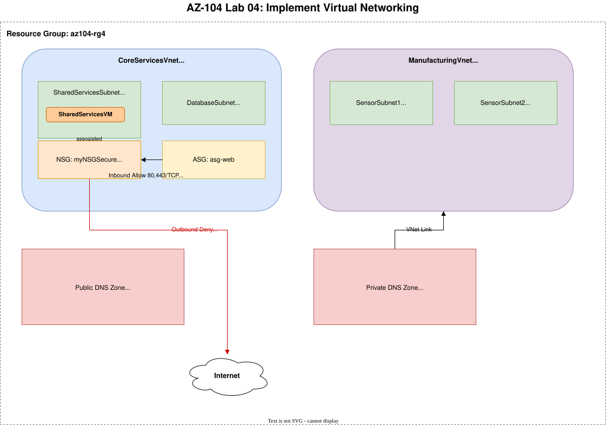
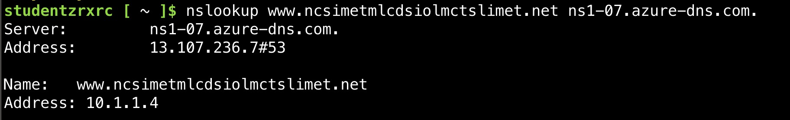
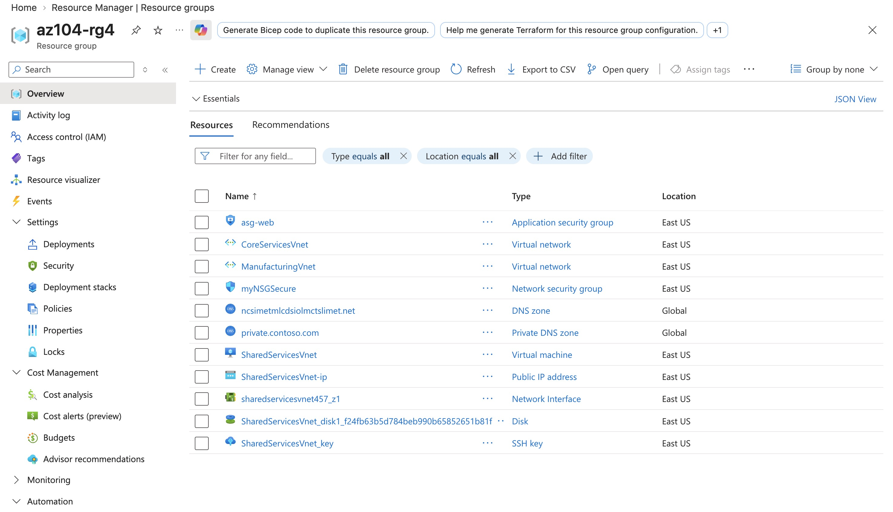

# Lab 04 - Implement Virtual Networking

**Certification:** AZ-104  
**Module:** [Lab 04 - Implement Virtual Networking](https://microsoftlearning.github.io/AZ-104-MicrosoftAzureAdministrator/Instructions/Labs/LAB_04-Implement_Virtual_Networking.html)  
**Date completed:** 2026-08-07  

## Scenario

> _Rewrite the lab's business context in your own words. Example: "Contoso Ltd needs to segment network access so the finance team's VMs cannot reach the dev team's VMs, while both can access a shared database subnet."_

## Architecture

_Editable source: diagram.drawio_

## What I Did

I've created the CoreServicesVnet within the Azure portal, then exported the ARM json, edited it manually and deployed it via "Deploy a custom template" Azure portal tool.
Here are the original [json template](./template_original_export.json) and [parameters](./parameters_original_export.json), and here the manually edited [json template](./template_manufacturing.json) and [parameters](./parameters_manufacturing.json)

Then I created an Application Security Group, a Network Security Group, and associated it to SharedServicesSubnet, and created a NSG rule to allow outbound TCP traffic from this new Application Security Group. Future VMs from this group will automatically be under this network rule. I've also created a VM to see how the Application Security Group is assigned to the NIC of the VM.  
And as last steps, I created a private DNS zone for the ManufacturingVnet and a public DNS zone for CoreServicesVnet.

Here's a screenshot of the DNS lookup for the public DNS Zone

and here's the full resource group:

## Gotchas & Learnings

- **Problem:** Exporting the ARM template from Azure portal and editing it is a lot of manual work  
    **Fix:** I did it this once for learning purposes.
    **Takeaway:**  But in the future I will create proper templates with proper variables, so that editing the template for another deployment will not be necessary.  
    
- **Learning:** DNS zones can be associated only to full Vnets, not Subnets.  
    **Takeaway:** My research says that for more granular DNS setups, one needs to use Azure DNS Private Resolver or DNS forwarding. But that's a task for another day. :)

- **Problem:** Azure template export is wonky. This time I tried the Azure CLI export and bicep processing, but it still generated redundant parts of the template.  
    **Takeaway:** In the real life one would start with an existing good template and extend from it.   

## Resources

- [Microsoft Learn module link](https://learn.microsoft.com/en-us/training/modules/configure-network-security-groups/)
- [GitHub lab instructions link](https://microsoftlearning.github.io/AZ-104-MicrosoftAzureAdministrator/Instructions/Labs/LAB_04-Implement_Virtual_Networking.html)

