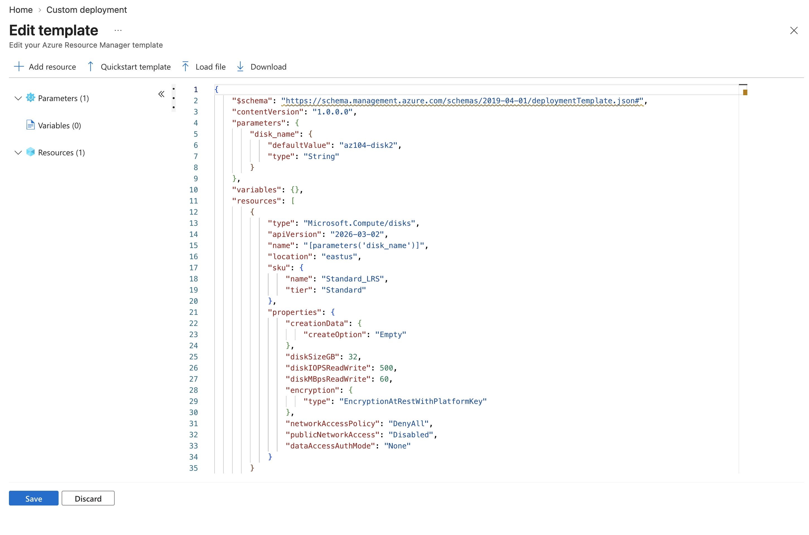
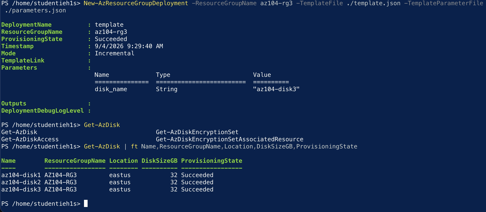
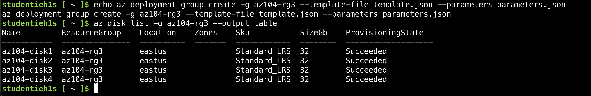
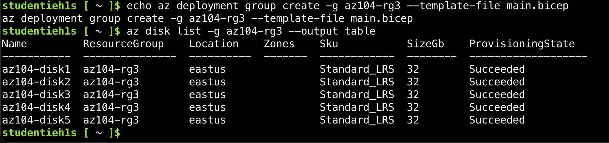

# Lab 03 - Manage Azure resources by using Azure Resource Manager Templates

**Certification:** AZ-104  
**Module:** [Lab 03 - Manage Azure resources by using Azure Resource Manager Templates](https://microsoftlearning.github.io/AZ-104-MicrosoftAzureAdministrator/Instructions/Labs/LAB_03b-Manage_Azure_Resources_by_Using_ARM_Templates.html)  
**Date completed:** 2026-09-04  

## Scenario

> _The company wants to automate and simplify deployments in order to reduce administrative overhead and human error. So we look into Azure Resource Manager (ARM) templates._

## What I Did

The first step is to create an Azure resource (a managed disk in this case), and export the ARM template: 
- [template.json](./template.json)
- [parameters.json](./parameters.json)

The first way to deploy the template is via the Azure Portal "Custom deployment" blade:

The second way to deploy the template is via the Azure Cloud Shell Powershell:

The next way is still using the Azure Cloud Shell and the Linux CLI:

The next way is to use a Bicep file instead of an ARM JSON: [main.bicep](./main.bicep). It can also be downloaded from the "Automation" section of a resource, but has to be cleaned since the export includes redundant lines.

And finally, one should delete all resources so that they do not create costs. Best way is to delete the resource groud `az group delete --name az104-rg3`

## Gotchas & Learnings
    
- **Learning:** In the Azure portal in the blade of a resource group, there is a Settings/Deployments blade that shows all deployments where one can view and verify the deployments.   
    **Takeaway:** The lab suggests to manually check the first few template deployments here to make sure it worked as expected.
    

## Resources

- [GitHub lab instructions link](https://microsoftlearning.github.io/AZ-104-MicrosoftAzureAdministrator/Instructions/Labs/LAB_03b-Manage_Azure_Resources_by_Using_ARM_Templates.html)

