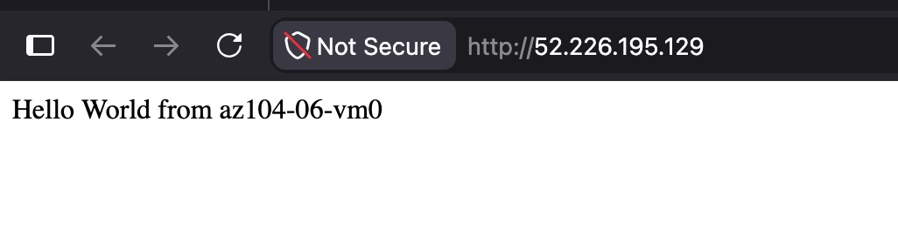
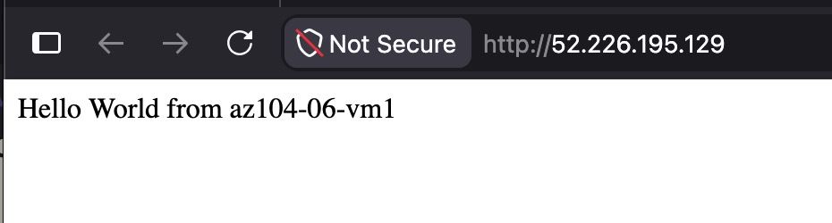
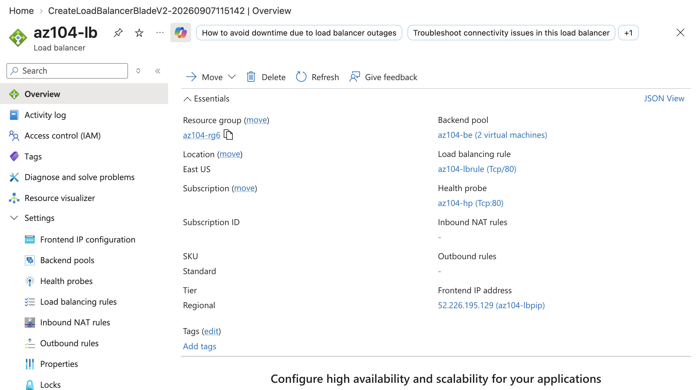
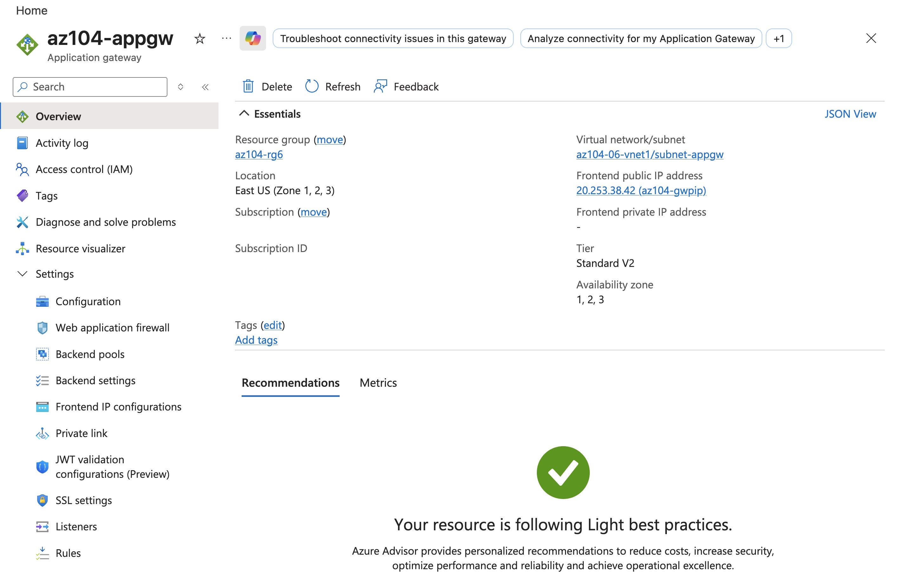
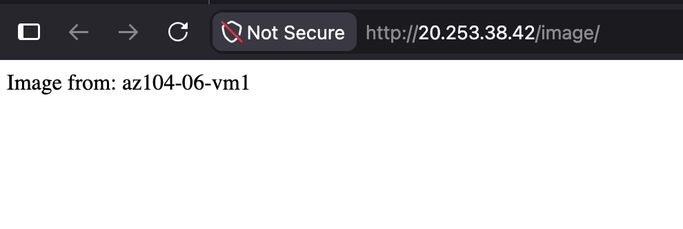
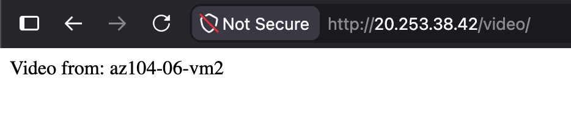
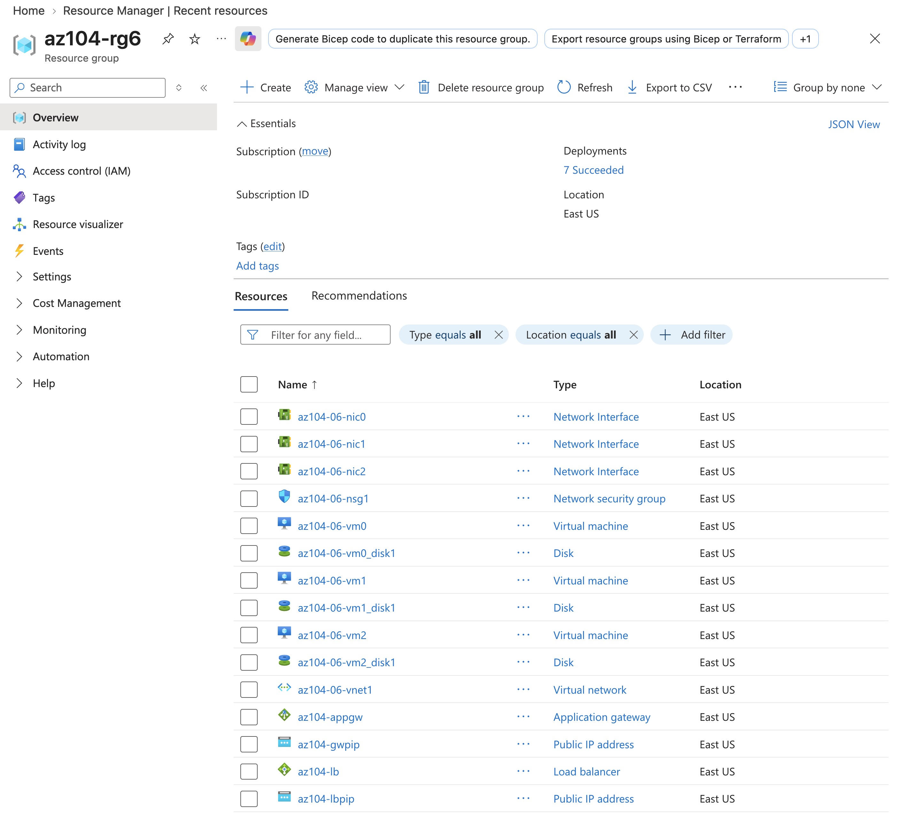

# Lab 06 - Implement Network Traffic Management

**Certification:** AZ-104  
**Module:** [Lab 06 - Implement Network Traffic Management](https://microsoftlearning.github.io/AZ-104-MicrosoftAzureAdministrator/Instructions/Labs/LAB_06-Implement_Network_Traffic_Management.html) 
**Date completed:** 2026-09-07  

## Scenario

> _The organization has a public website with high traffic that needs to be served by several servers, so a load balancer is neeeded. In addition to a classic load balancer, we set up an Azure Application Gateway to do a more fancy version of load balancing._

## What I Did

After creating the resource group, I used the template from the lab to create the resources.

The deployment took a while because one of the 3 VMs took a long time to be created. Time to get a coffee ☕️.

Then I could create and set up the load balancer manually. It took several steps to create and then set it up correctly, but now it is happily balancing between vm0 and vm1:

Then I created and set up the Application Gateway. It is also a resource that needs several steps to set up:

The cool thing that an Application Gateway can do is to look into the IP packages, since it works on layer 7. In this lab, I have set it up to direct URLs with `/image/*` to a certain backend target pool (list of VMs) and `/video/*` to another backend target pool, so that both can be served by specialized servers:

Here is a screenshot of the full resource group:

## Gotchas & Learnings

- **Learning:** An Application Gateway is a sort of loadbalancer on level 7, meaning it can look into the packets and act accordingly. The "normal" load balancer is on level 4 and only sees IP and protocols.   
    

## Resources

- [GitHub lab instructions link](https://microsoftlearning.github.io/AZ-104-MicrosoftAzureAdministrator/Instructions/Labs/LAB_06-Implement_Network_Traffic_Management.html)

