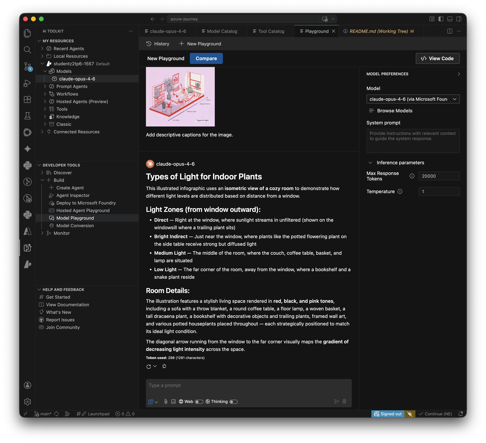

# Lab: Prepare for an AI development project

**Certification:** AI-900  
**Module:** [Plan and prepare to develop AI solutions on Azure](https://learn.microsoft.com/en-us/training/modules/prepare-azure-ai-development/)  
**Date completed:** 2026-04-10  
Lab URL: https://microsoftlearning.github.io/mslearn-ai-studio/Instructions/Exercises/01-Explore-ai-studio.html

## Scenario

> A company wants to move to the Azure Cloud and use its AI capabilities. They need to get familia with the process of Microsoft Foundry

## What I Did

- installed the azure CLI
- created a Foundry project
- deployed an LLM model
- got familiar with the connection of Foundry project and parent Resource
- Installed the AI Toolkit extension for Visual Studio Code
- Tested the deployed LLM via this plugin

