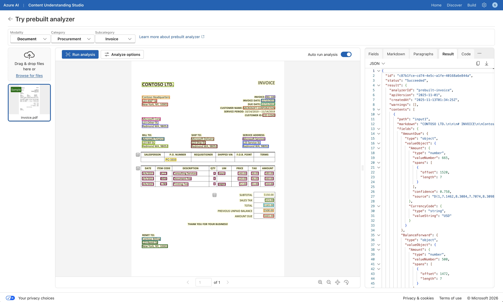
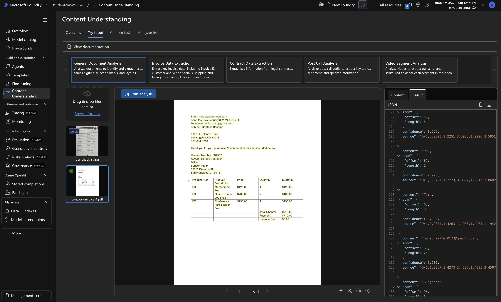

# Lab: [Get started with information extraction in Microsoft Foundry](https://microsoftlearning.github.io/mslearn-ai-fundamentals/Instructions/Exercises/06a-content-understanding.html)

**Certification:** AI-900  
**Module:** [Get started with AI-powered information extraction in Azure](https://learn.microsoft.com/en-us/training/modules/get-started-information-extraction/)  
**Date completed:** 2026-04-23  

## Scenario

> A company has a lot of paper documents that they want to process and extract information that can be used for business intelligence. Also the processing of those paper documents containts a lot of manual typing into digital forms like Excel, that they want to automate. They explore the possibilities that Azure Content Understanding can provide them.

## What I Did

I explored the Content Understanding Tools of Azure. There are the Content Understanding Studio and Content Understanding in classic Foundry. I also created a simple python script to extract information from a image (url) via API: [Python Program](./content_understanding.py)

## Screenshots

| Step                      | Screenshot                             |
| ------------------------- | -------------------------------------- |
| Content Understanding Studio    |    |
| Content Understanding in classic Foundry      |     |

## Gotchas & Learnings

- **Problem:** [What went wrong or confused you]  
    **Fix:** [How you resolved it]  
    **Takeaway:** [What you now understand better]
    
- **Problem:** Python program error: "Resource not found..."  
    **Fix:** Use the right API Endpoint  
    **Takeaway:** Azure Foundry tries to help with finding the right API endpoint, but still there are several ones and for this Information Extraction / Document Intelligence I need an enpoint that looks like this: `https://resource-name.cognitiveservices.azure.com/` and the following seems to work as well: `https://resource-name.services.ai.azure.com/`

Learnings:

Content Understanding is still easier found from the classic Foundry portal, and there is a separat Content Understanding Studio: https://contentunderstanding.ai.azure.com

