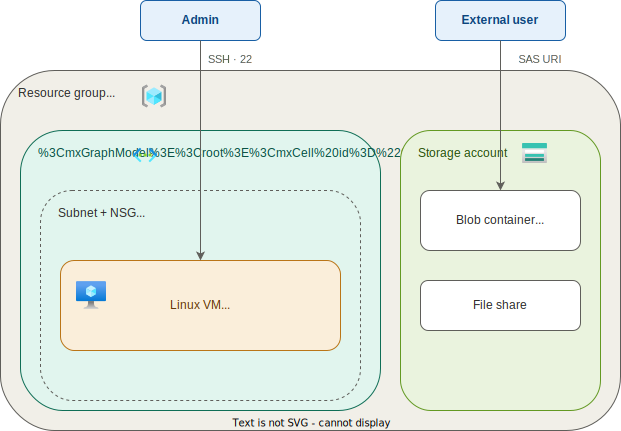

# Lab: [Get started with Azure management tasks](https://github.com/MicrosoftLearning/AZ-100-Get-started-with-Microsoft-Azure-Management-tasks)

**Certification:** AZ-100  
**Module:** [Microsoft Applied Skills: Get started with Azure management tasks](https://learn.microsoft.com/en-us/credentials/applied-skills/get-started-with-azure-management-tasks/)  
**Date completed:** 2026-04-15  

## Scenario

> A company wants to stop bying and maintaining their own server machines. So they start setting up virtual machines, since they have a lot of good linux administrators that can work with the VMs directly, and want to keep the direct access to the machine (via SSH). So they need to manage the VMs, the virtual networks and (blob-) storage options.

## Architecture Diagram

## What I Did

Prepare:
- create resource group to manage resources of this lab
- create virtual network
- create virtual machine
- create storage account
- update virtual network with new subnet and a new network security group
- setup existing vm with the new subnet (and security group)
- scale up (vertically) the VM
- add storage disc to VM
- set daily auto-shutdown for cost savings
- create storage container and upload a file manually
- create file share in storage account
- use Storage Browser in Storage Account to create SAS (shared access signature), a URI with restricted access that can be used by anyone
- add deletion lock for vm so that no one can delete it by accident
- add tags to vm and network for better management of those resources

## Gotchas & Learnings

**Problem:** My Account (from the learning provider) was not able to delete Resource Locks.  
**Fix:** Wait until the account and its resources are automatically deleted.  
**Takeaway:** I'm using a training provider that creates short term login credentials that are cool to navigate in the real Azure portal. Interestingly, my account was able to create Delete and Read-Only Locks but could not lift them, it could only switch between both, once the lock was created. In a normal environment I would ask someone with a higher permission level, but here, the login credentials and all resources are automatically deleted after a couple of hours. So nothing to worry.

This was preparation for the [Microsoft Applied Skills: Get started with Azure management tasks](https://learn.microsoft.com/en-us/credentials/applied-skills/get-started-with-azure-management-tasks/) which is a microsoft offering of a free credential by creating a virtual windows machine and azure login and a series of emails from my "virtual employer", wo asks me to do certain tasks in Azure.  
It's really cool, one has 2 hours to finish all tasks and there is not much guidance, like in real life :)  
Here's my successfully passed credential:  
https://learn.microsoft.com/api/credentials/share/en-us/ViktorPapara-4812/58E02C531D9D9D76?sharingId=B05B7E2C4C01EAC5
